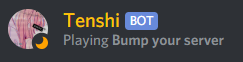
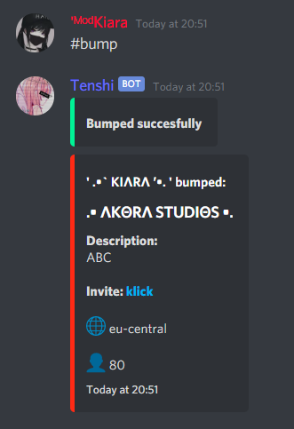
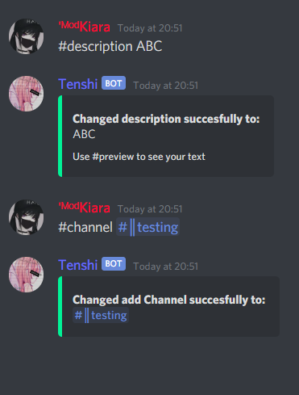
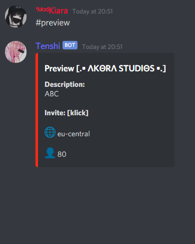

# Bump-Bot
**Discord.js Server Bump Bot (v12) / Server Advertise Bot**

<br/>

[](https://discord.gg/Emk2udJ)

# ⚙️ Setup
## 🔧 Configuration
> **[index.js  line 20](https://github.com/DragonCat4012/Bump-Bot/blob/main/index.js#L20)**
> ```JS
> const supportGuildId = ''
> const supportGuildLogChannelId = ''
> var Bottoken = ''
> ```

<br />

## 🤖 Example Setup
> ```JS
> const supportGuildId = '553942677117337600'
> const supportGuildLogChannelId = '753474865104683110'
> var Bottoken = 'NzA3NTQ4MDadsfghijklmnzY5.NzA3NTQ4MDMopqrstzMjA4NzY5FSDFSDf.sdf21'
> ```

<br />

## 🌿 Run
```node index.js```
(remember to install all needed dependecies ;3 Use ```npm i``` to install them )

<br />

## Commands
|  Name         | Beschreibung                              |
| ------------- | ----------------------------------------- |
| bump          | Bumps your Server                         |
| channel       | Change your server advertisment channel   |
| color         | Change your bump embed color              |
| description   | Change your server description            |
| goodbye       | Change your server goodbye channel        |
| help          | Shows you all my Commands                 |
| invite        | Get my Invite link :3                     |
| prefix        | Change your server prefix                 |
| preview       | Shows your server bump embed              |
| welcome       | Change your server welcome channel        |


<br />
<br />

## 🍂 Dependencies
* [discord.js](https://www.npmjs.com/package/discord.js)
* [parse-ms](https://www.npmjs.com/package/parse-ms)
* [sequelize](https://www.npmjs.com/package/sequelize)
* [sqlite3](https://www.npmjs.com/package/sqlite3)

<br />

## ☘️ Example


```json
Logging in...                            index.js:98
 > 🗸 Server Cache                        database/dbInit.js:50
 > 🗸 Cached Database Entries             index.js:71
 >  Logged in as: Tenshi#3639            index.js:118
.• ΛΚΘRΛ SΤUDΙΘS •.   >>>  bumped!
```

<br /><br />

## 📸 Showcase
Note: the default prefix is %
| Bump | Setup | Preview|
| - | - | -|
||||
